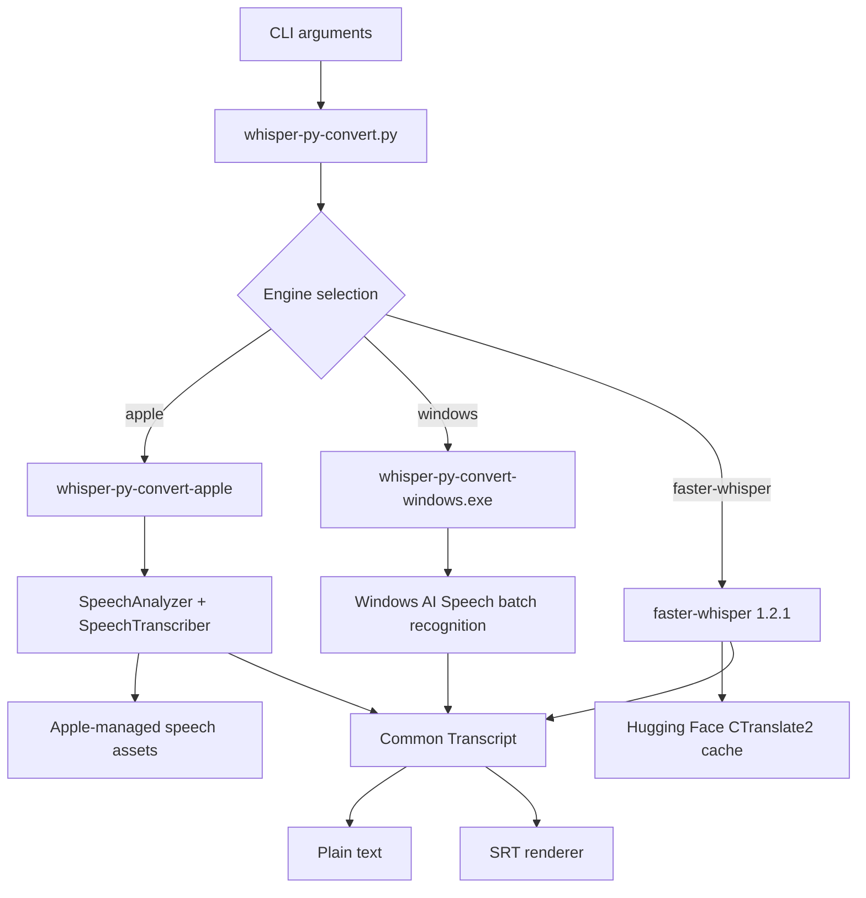
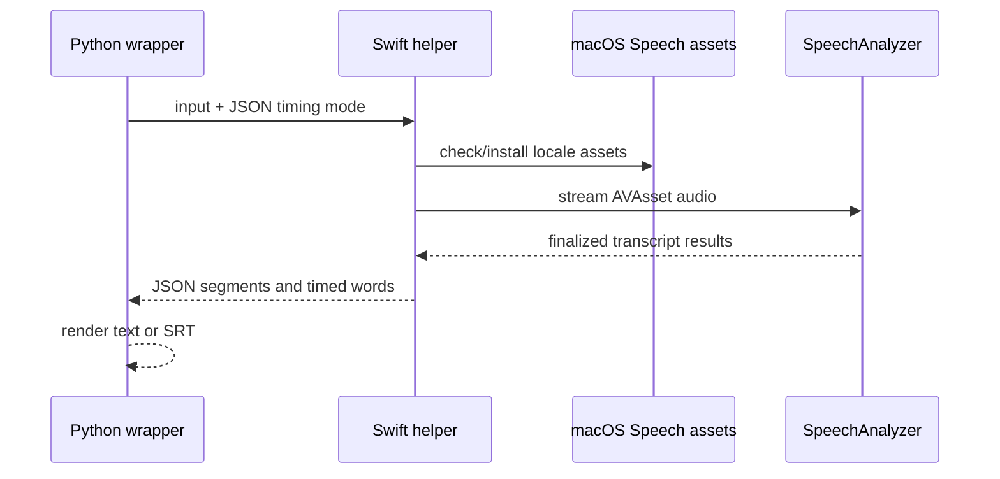
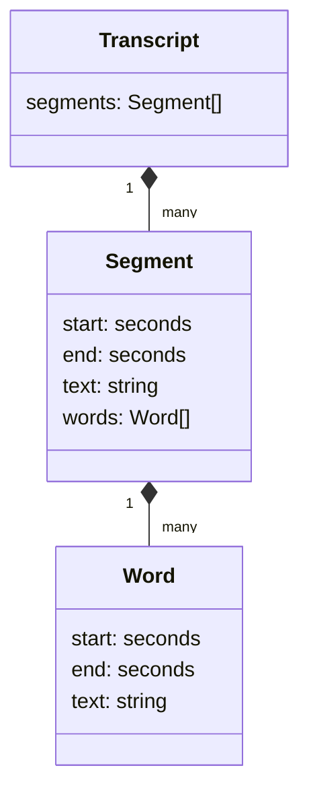
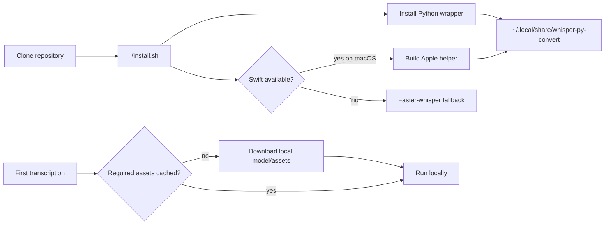

# Architecture and extension guide

## Runtime flow



The Python file is the stable command-line boundary. It owns argument parsing,
engine selection, output-file handling, and stdout/stderr behavior. Backend
implementations return plain transcript text; they should not write progress to
stdout because users may redirect stdout to a transcript file.

## Engine selection

`--engine auto` is the default. It selects Apple when the native executable is
present, otherwise faster-whisper. Explicit selection is available for testing
and reproducibility:

```sh
whisper-py-convert --engine apple recording.mp4
whisper-py-convert --engine faster-whisper --model small.en recording.mp4
```

The Apple backend does not expose Whisper model names. macOS selects and
manages the appropriate speech model for the requested locale. The first use
of a locale may download Apple speech assets; audio processing is local after
the assets are installed.

## Apple backend lifecycle



`Sources/WhisperAppleTranscribe/main.swift` performs these steps:

1. Validate the input path and requested locale.
2. Create a `SpeechTranscriber` and check/install its Apple-managed assets.
3. Create an `AVAsset` and `AssetInputSequenceProvider`, allowing audio/video
   containers such as MP3 and MP4 to be decoded by the system.
4. Feed the provider sequence into `SpeechAnalyzer`.
5. Consume finalized `SpeechTranscriber` results and write them to stdout.

The target is macOS 27 because `AssetInputSequenceProvider` and the current
audio/video sequence path are macOS 27 APIs. The Apple backend is therefore
optional; the Python/faster-whisper path remains the fallback on older macOS
versions and other operating systems.

The Windows helper is an optional MSIX-packaged C# executable. It uses Windows
AI Speech batch recognition on supported Windows 11 24H2+ hardware. It
currently returns plain text; timed subtitle output should use faster-whisper
until the Windows API exposes the required timing metadata in a stable release.

## Timestamp model



The Python layer normalizes timed backends into:

```text
Transcript
└── segments: start, end, text, words
    └── words: start, end, text
```

`--srt --seg-ts` renders one subtitle cue per segment. `--srt --word-ts`
renders one cue per timed word. Faster-whisper computes word timings with its
word-timestamp option. Apple emits `SpeechTranscriber` attributed text with
`audioTimeRange` attributes, which the Swift helper serializes as JSON for the
Python renderer.

## Adding another backend

Keep the backend contract small:

1. Add a new CLI value to `--engine`.
2. Add `find_<backend>_binary()` or a dependency check.
3. Add `transcribe_with_<backend>(args) -> Transcript`.
4. Call it from `main()` and keep diagnostics on stderr.
5. Document installation, privacy, model/assets, and offline behavior.
6. Add a short deterministic smoke test to the verification section below.

Do not make the Python wrapper depend on Apple-only imports. Do not make the
Apple binary depend on Python or faster-whisper.

## Installation and caches



`install.sh` copies the Python entrypoint and, on a Mac with Swift, builds and
copies the Apple executable into:

```text
~/.local/share/whisper-py-convert/
~/.local/bin/whisper-py-convert -> .../whisper-py-convert.py
```

The faster-whisper package is pinned to `1.2.1` and is installed lazily. Its
models are cached by Hugging Face under `~/.cache/huggingface/hub`. An optional
`HF_TOKEN` is passed to the Hugging Face client without being printed or
stored by this project.

## Verification

From the repository directory:

```sh
python3 -m py_compile whisper-py-convert.py
swift build --configuration release
python3 whisper-py-convert.py --check
```

For a local Apple smoke test without a private recording:

```sh
say -o /private/tmp/whisper-py-convert-test.aiff \
  'This is a local transcription test.'
python3 whisper-py-convert.py --engine apple \
  /private/tmp/whisper-py-convert-test.aiff
```

The first Apple run may install speech assets. A second run should not repeat
the asset-installation message. To test the fallback explicitly, use
`--engine faster-whisper --model small.en`.
