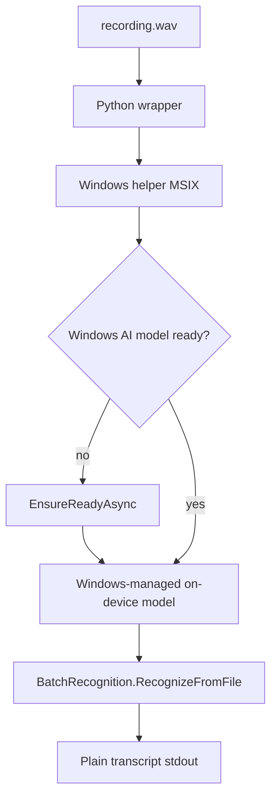

# Windows native backend

This optional helper uses the Windows AI Speech API rather than Whisper. It
transcribes audio on the Windows machine and writes plain transcript text to
stdout so the Python wrapper can use it as an engine.



## Requirements

- Windows 11 24H2 (build 26100) or later
- Windows App SDK 1.7.1 or later; the API is currently experimental in some
  SDK releases
- Copilot+ PC hardware with an NPU, or a Windows machine meeting Microsoft’s
  supported CPU requirements
- An MSIX package with the `systemAIModels` capability
- .NET 8 SDK and a Windows build environment

Microsoft’s current API supports batch recognition from a file and streaming
recognition from an audio source. The model runs on-device after Windows has
prepared it. See Microsoft’s prerequisites before distributing this helper:

<https://learn.microsoft.com/en-us/windows/ai/apis/speech-recognition>

## Build


From PowerShell in the repository root:

```powershell
dotnet restore windows/WhisperPyConvert.Windows.csproj
dotnet publish windows/WhisperPyConvert.Windows.csproj `
  -c Release -r win-x64 --self-contained false `
  -o windows/publish
```

The MSIX manifest must be signed with a certificate whose publisher matches the
manifest identity. After publishing, place the resulting
`whisper-py-convert-windows.exe` beside the Python wrapper or under
`windows/publish/`. Then:

```powershell
python whisper-py-convert.py --engine windows recording.wav
```

The Windows native backend currently uses the Windows speech language/model
configuration and produces plain text only. Use
`--engine faster-whisper --srt --seg-ts` or `--word-ts` when subtitle timing
is required, because the current Windows batch API returns a transcript string
from `RecognizeFromFile`.
